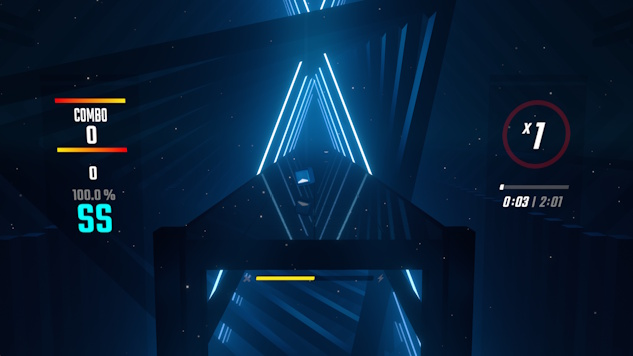
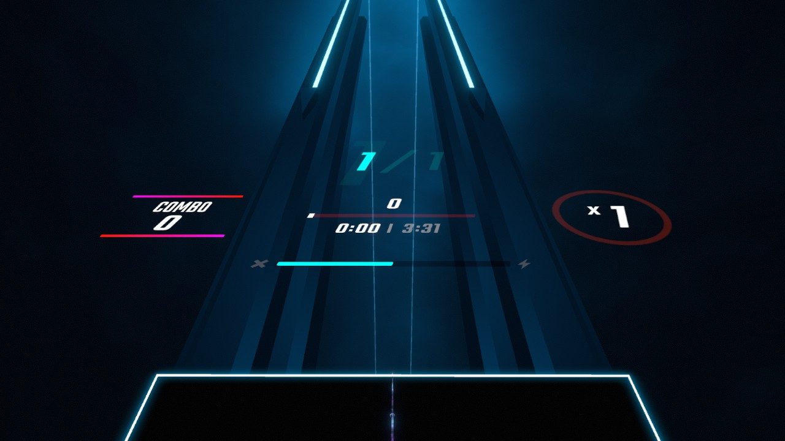

# 🛠️ UITweaks - For Beat Saber 1.37.0+
A Beat Saber mod that aims to bring more color to the in-game HUD!

## Dependencies:
- BSIPA v4.3.4+
- SiraUtil v3.1.10+
- BeatSaberMarkupLanguage v1.11.2+

## Features
- Multiplier ring colors, as well as an option to smoothly transition between them, and an optional rainbow animation on full 8x multiplier.
- Energy bar colors corresponding to your current energy, and an optional rainbow animation on full.
- Combo FC line colors, including optional gradient lines.
- Colors for the progress bar, background, and slider knob. There also exists an option to smoothly transition between two colors as the song progresses.
- (IN-DEV) Multiplayer player position panel colors for each position, an option to hide the first place animation, and an option for the static panel to use a static color.
- And so much more!

## Screenshots:
**Standard Gameplay:**
> 

**Online:**
> 

## Development Roadpath
- Fix multiplayer
- Add BSML settings for all new features
- Rework and optimize internals
- Compatibility with other UI mods like Counters+ and the Heck suite
- Bug fixes and new features as fit

## Contributing
Do you have a feature request or a bug to report? You can [open an issue here](../../issues)! You can also reach out to me on Discord in the BSMG server, or directly at `@exomanz`.

Alternatively, you can download the source code and build the project yourself. Once you have a working build, you can [submit a pull request here](../../pulls).
